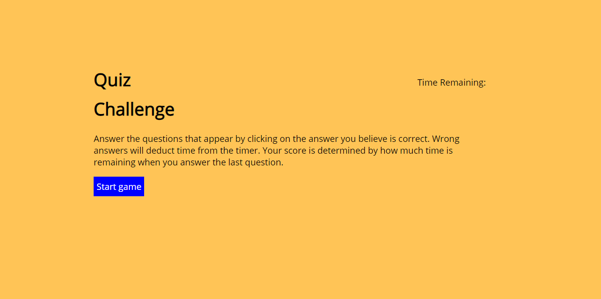

# Quiz-game



Description
------------

This is a quiz game. It will ask if you would like to start the game. After starting the game, the questions will appear in the large font and you must choose the correct answer from the buttons shown. Your score is the time you have remaining.

 Table of contents
---------------
[Tools used](#Tools-used)<br />
[Deployed here](#Deployed-here)<br />
[What is added](#What-is-added)
* [Start Game](#Start-game)
* [Display timer](#Display-timer)
* [Display question](#Display-question)
* [Create buttons](#Create-buttons)
* [Check response](#Check-response)
* [End game](#End-game)
* [Input highscore](#Input-highscore)


[Credits](#Credits)<br />
[License](#License)

Tools used
-------------------

* CSS - Style the page with custom colors, and spacing.
* GitBash - Assist with version control via commits, push, and pull to and from GitHub.
* GitHub - Site where the repository lies for deployment and edits.
* HTML - Contains the entirety of the webpage and allows browsers to interpret the code as a webpage.
* JavaScript - Houses the majority of the function action for this webpage. 
* VS Code - Application used to write and edit code for the webpage.

Deployed here
-------------

Below is the link to the deployed webpage. <br />
[Link to site](https://vincent-nguyen8931.github.io/Quiz-game/)


What is added
------------------

Start game
-----------------------

This function will begin the game and each time the quiz is restarted. 
```
function startGame() {
  responses.removeAttribute("class", "d-none")
  displayQuestion();
  createButtons();
  displayTimer();
}
```

Display timer
---------------
The time is displayed on the top right of the question box. The setTimeout function is to update the time immediately upon answering a question incorrectly.
```
function displayTimer() {
  minusTime = setTimeout(function () {
    remainingTime.textContent = ("Timer: " + timer)
    timeLeft = setInterval(function () {
      remainingTime.textContent = ("Timer: " + timer--)
      // prevents timer from dropping below 0 on its own
      if (timer < 0) {
        clearInterval(timeLeft)
        endGame()
      }
    }, 1000)
  }, 10)
}
```

Display question
-----------
The questions will be displayed by hiding the start button, hiding the landing page text, and generating the question in the h1 tag.
```
function displayQuestion() {
  startBtn.style.display = "none"
  intro.textContent = ""
  h1Body.textContent = questionResponse[questionNumber].q
}
```

Create buttons
----------------
Buttons are created from the response object within the questionResponse array. A forEach is called to create a button, give it the class "button", fill its textContent with the possible responses, and append the child to the responses list. These buttons are what allows the player to give their answer to the quiz questions.
```
function createButtons() {
  // creates variable holding the object response within the questionResponse object
  var resp = questionResponse[questionNumber].response
  // takes value of the response object and places them into the answers variable
  var answers = Object.values(resp);
  // clears text for the next question value to be entered
  responses.innerHTML = ""
  // creates the button, sets the class to button, fills the textcontent with answers variable, and appends the child to the responses list
  answers.forEach(element => {
    var li = document.createElement("button");
    li.setAttribute("class", "button");
    li.textContent = element;
    responses.appendChild(li);
  });
}
```

Check response
----------
This function checks the user's response against the correct answers set in the questions array. It will also check to make sure that there is a question that exists to prevent the program from asking more questions than exist. This snippet shows how this is accomplished.
```
function checkResponse(event) {
  if (questionNumber < questionResponse.length - 1) {
    var element = event.target
    // checks for element matching a button to be true and the text content of said button matches the correctResponse. if true then the answer is correct.
    if (element.matches("button") === true && questionResponse[questionNumber].correctResponse === element.textContent) {
```

End game
--------------------
This ends the game by allowing the user to enter their high scores, removing all the responses, and stopping the timer.
```
function endGame() {
  h1Body.textContent = "Quiz complete!";
  highscore.setAttribute("class", "d-block");
  responses.setAttribute("class", "d-none");
  submitBtn.style.display = "block";
  clearInterval(timeLeft);
}
```

Input highscore
--------
After the player has entered their name into the input field, they will click the submit button that has an event listener added to it. Here their name and score are added to a list element and then gets appended to the highscore list.
```
submitBtn.addEventListener("click", getHighscores);

function getHighscores() {
  nameLi = document.createElement("li")
  nameLi.textContent = "name: " + highscore.value + " score: " + timer;
  highscoreList.appendChild(nameLi);
  printHighscores()
}
```

Lessons Learned
----------------

I ran into a strange situation where the incrementing variable is called 1 + (n+1) times for reasons unknown to me. Things I have tried were:
* reconstruct the questions array to house an individual true or false response for the possible answers.
* change where the check for question length happens to before an answer check is run
* have the answers increment instead of the start game function
* remove the click event listener since it appeared as though multiple clicks were being counted despite only a single click being used when I checked in the console logs

The solution reached upon TA assistance is to not have the functions call each other recursively. They recommended that the events should be what moves one function to another. I altered my code to reflect these changes and the game works as intended.


Credits
---------------
LinkedIn: [https://www.linkedin.com/in/vincent-nguyen-74226a107/](https://www.linkedin.com/in/vincent-nguyen-74226a107/) <br />
GitHub: [https://github.com/vincent-nguyen8931](https://github.com/vincent-nguyen8931)


License
----------
MIT License

Copyright (c) [2020] [Vincent Nguyen]

Permission is hereby granted, free of charge, to any person obtaining a copy
of this software and associated documentation files (the "Software"), to deal
in the Software without restriction, including without limitation the rights
to use, copy, modify, merge, publish, distribute, sublicense, and/or sell
copies of the Software, and to permit persons to whom the Software is
furnished to do so, subject to the following conditions:

The above copyright notice and this permission notice shall be included in all
copies or substantial portions of the Software.

THE SOFTWARE IS PROVIDED "AS IS", WITHOUT WARRANTY OF ANY KIND, EXPRESS OR
IMPLIED, INCLUDING BUT NOT LIMITED TO THE WARRANTIES OF MERCHANTABILITY,
FITNESS FOR A PARTICULAR PURPOSE AND NONINFRINGEMENT. IN NO EVENT SHALL THE
AUTHORS OR COPYRIGHT HOLDERS BE LIABLE FOR ANY CLAIM, DAMAGES OR OTHER
LIABILITY, WHETHER IN AN ACTION OF CONTRACT, TORT OR OTHERWISE, ARISING FROM,
OUT OF OR IN CONNECTION WITH THE SOFTWARE OR THE USE OR OTHER DEALINGS IN THE
SOFTWARE.